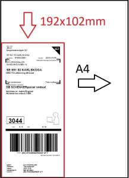

# SchenkerUnifaun_Label_trim
Schenker Unifaun export labels as full A4. This python code trim to the correct ratio on Schenker labels.

Used for labels created on https://www.dbschenker.com/se-sv/foretag/digitala-tjanster/boka-landtransport

Exact margins set to fit print from Adobe Reader.

Written in Python 3.12

```
C:\USERS\USER\DROPBOX\AUTOMATISERING\SCHENKER
│   SchenkerTrim.bat
│   SchenkerUnifaun.py
│
├───crop_input
│       prt779552533_0.pdf
│       prt779552539_0.pdf
│
└───crop_output
        combined_20231031_194547.pdf
```


White space removed around the label

## Features

Files in same folder as SchenkerUnifaun.py will be placed under folder crop_input and cropped pdf-files under crop_output.
Set combine flag to 1 in code to combine output file, 0 to save to separate files.

Only files beginning with prt ending with .pdf will be handled by the script.

## Setup

Install dependencies
```
pip install PyPDF2
pip install subprocess
```

1. Change filepath in the Py-file, set location where prt*.pdf files are located
2. Change bat filepath to where SchenkerUnifaun.py is located (optional if you want to run from bat-file)
