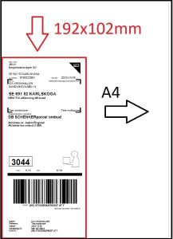

# SchenkerUnifaun_Label_trim
Schenker Unifaun export labels as full A4. This python code trim labels to fit Zebra GK420D 192x102mm labels

Exact margins set to fit print from Adobe Reader.

Written in Python 3.12

## Setup
1. Change filepath where trp*.pdf files are located
2. Change bat filepath to where SchenkerUnifaun.py is located (optional if you want to run from bat-file)
